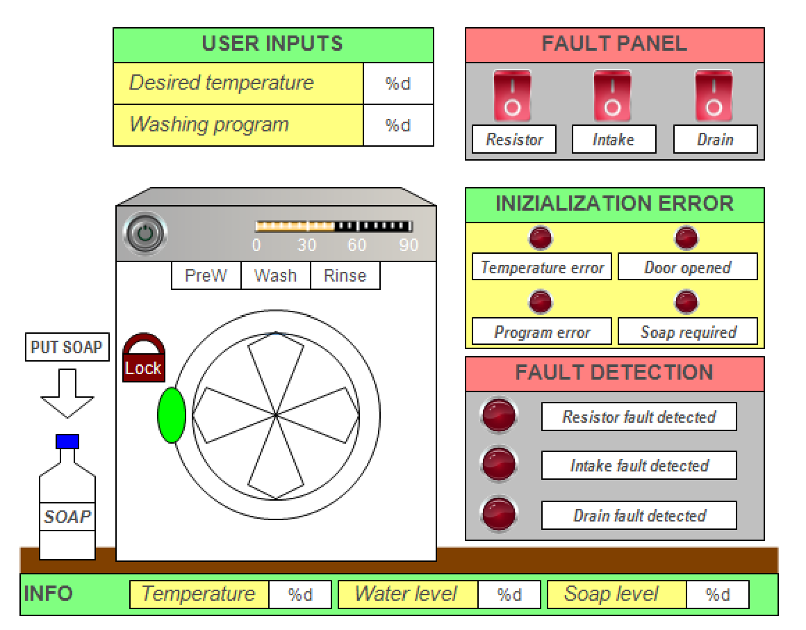

# WashingMachinePLC

This repository contains the project for logical controllers of a washing machine developed for a Automation Engineering course (A.A. 2023-2024) by Simone Utili.

## Overview

The project implements the control logic for a washing machine using a PLC programming approach based on the IEC 61131-3 standard. The system handles the complete washing cycle, including startup conditions, normal operation, pause functionality, cycle completion, and comprehensive fault detection and management.

## Features

- **Nominal Operation**
  - **Input Validation:** Upon pressing the Run button, the system enters a pending state and checks that all required inputs (temperature, program selection, door closure, and soap presence when needed) are correctly set.
  - **Cycle Execution:** Once verified, the door is locked and the washing program is executed. At the end of the cycle, visual feedback (flashing LEDs) indicates completion.
  
- **Pause Functionality**
  - Allows temporary suspension of the washing cycle with a subsequent resumption from the paused state using a dedicated flag (SFCPause).

- **Fault Management**
  - **Local Fault Detection:** Implemented within function blocks (GAs) to monitor sensors and actuators.
  - **Global Fault Handling:** The Parent Policy Automata coordinates with Child Policy Automatas to manage faults. The system adapts by either degrading the operation (e.g., bypassing temperature control or adjusting cycle duration) or suspending the process entirely for critical faults.
  - **Fault Recovery:** Includes tests to verify the proper functioning of repaired components before returning to nominal operation.

## Software Architecture

### 1. Function Blocks (Generalized Actuators - GAs)
The control logic is modularized into function blocks that handle specific actions:
- **WaterFilling:** Controls water intake up to a predefined level.
- **WaterEmptying:** Manages water drainage.
- **TemperatureControl:** Regulates water temperature.
- **DoorLocking / DoorUnlocking:** Manages the locking mechanism of the washing machine door.
- **DrumMotor Control:** Activates the washing machine’s drum motor.
- **Soaping:** Controls soap dispensing for the washing process.

### 2. Programs
The overall control logic is distributed among several programs:
- **ParentPolicyAutomata:** The main state machine that coordinates the system’s overall behavior.
- **ChildPolicyAutomatas:** Manage nominal operation (Nominal_PA) and degraded modes (e.g., for water input faults or heating faults) based on fault conditions.
- **GA_Collector:** Contains the instantiation of all defined Generalized Actuators.
- **Simulation_Program:** Facilitates simulation of the washing machine operation without hardware.

### 3. Functions
Utility functions have been implemented to:
- Verify that the user-selected program and temperature are valid.
- Set or reset groups of boolean variables.
- Signal faults on the Human-Machine Interface (HMI).
- Diagnose and isolate specific fault conditions.

## Fault Management and Diagnostics

The system employs a two-tier fault management strategy:
- **Detection:** Each GA monitors its own sensors and actuators, encapsulating fault detection at the local level.
- **Handling:** Depending on the detected fault:
  - The control logic may switch to a degraded mode (e.g., operating at a lower temperature or shortening phase durations) while still completing the wash cycle.
  - For critical faults (e.g., severe water filling issues or drainage failures), the system safely halts operation and signals an idle state pending maintenance.
- **Recovery:** Once faults are cleared, a test sequence is executed to confirm the proper operation of the affected components, allowing the system to return to nominal functionality.

## Simulation Diagram

Below is a simplified diagram of the simulated washing machine interface and its components:



1. **User Inputs**: Temperature setting and washing program selection.  
2. **Fault Panel**: Three switches to simulate faults in the heating resistor, water intake, or water drain.  
3. **Run Button**: Starts or pauses the washing cycle.  
4. **Door Lock Indicator**: LED that signals if the door is locked.  
5. **Soap Tray**: Indicator or button for adding soap.  
6. **Status LEDs**: Three LEDs indicating which phase (PreWash, Wash, Rinse) is currently active.  
7. **Fault Detection Panel**: Shows which fault(s) have been detected. 

## Getting Started

### Prerequisites
- **PLC Programming Environment:** (e.g., Codesys)
- **Simulation Environment:** If you are testing the control logic without a physical washing machine.

### Installation
1. **Clone the Repository:**
   ```bash
   git clone https://github.com/Simoneutili/WashingMachinePLC.git

2. **Import the Project**
Launch your PLC programming software and import the project files from the cloned repository.

3. **Configure Simulation Settings**
Adjust the simulation parameters in the Simulation_Program module as needed.

4. **Running the Simulation**
    - Start the `Simulation_Program` in your PLC environment.
    - Use the HMI to observe system behavior during normal operation and fault conditions.
    - Follow on-screen instructions to simulate inputs and trigger faults as outlined in the project report.


## Additional Documentation
For a detailed overview of the control logic and system architecture, please refer to the project report.